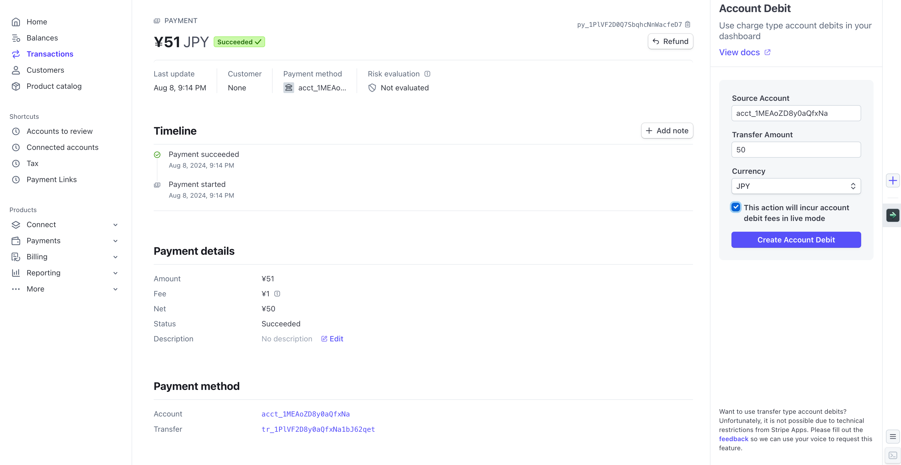

# Account Debit in Dashboard

This Stripe App enables you to perform [Account Debits](https://docs.stripe.com/connect/account-debits) directly from the Dashboard, a feature not natively supported by Stripe.

## Prerequisites
- [Stripe CLI](https://docs.stripe.com/stripe-cli) installed
- Account verified for live mode

## Installation
1. Download this repository
2. Run `stripe login` to authenticate your account
3. Modify the `id` in `stripe-app.json`. Use your account ID to prevent duplication errors (e.g., com.acct_XXXX.account-debit)
4. Execute `stripe apps upload` to upload the app
5. Release the uploaded version and install the app (refer to [Stripe Apps documentation](https://docs.stripe.com/stripe-apps/versions-and-releases))

## Usage
1. Locate the app on the right side of your Dashboard
2. Input the required details:
   - Connected account ID
   - Amount
   - Currency
3. Check the confirmation checkbox
4. Click "Create Account Debit"

## FAQ

**Q: Can I release a public version of this app?**

A: No. Due to technical limitations in creating charge objects, the app cannot function as a public version.

**Q: Why can't I use the transfer type of account debit?**

A: Creating transfer objects on behalf of connected users is technically limited, making transfer-type account debits impossible through this app.

**Q: Does it cost stripe fee?**

A: Generally yes, please refer to [Connect Pricing Page](https://stripe.com/connect/pricing). It cost 1.5% of debit volume.
