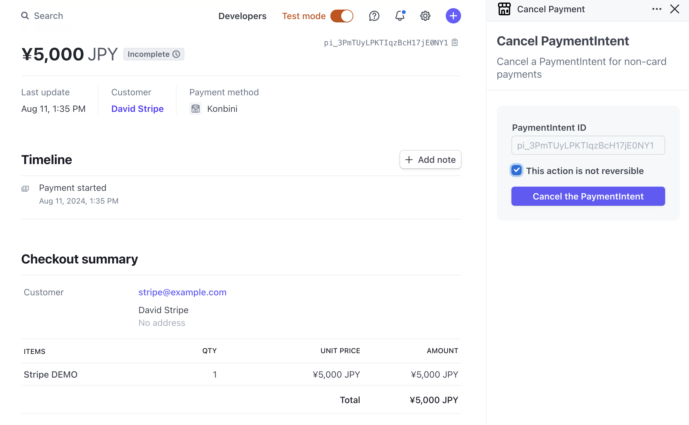

# Cancel Payments in Dashboard

This Stripe App enables you to cancel the non-card payment directly from the Dashboard, a feature not natively supported by Stripe.(e.g. [Konbini](https://docs.stripe.com/payments/konbini))

## Prerequisites
- [Stripe CLI](https://docs.stripe.com/stripe-cli) installed
- Account verified for live mode

## Installation
1. Download this repository
2. Run `stripe login` to authenticate your account
3. Modify the `id` in `stripe-app.json`. Use your account ID to prevent duplication errors (e.g., com.acct_XXXX.account-debit)
4. Execute `stripe apps upload` to upload the app
5. Release the uploaded version and install the app (refer to [Stripe Apps documentation](https://docs.stripe.com/stripe-apps/versions-and-releases))

## Usage
1. Navigate to the payment detal page you want to cancel
2. Check the confirmation checkbox
3. Click "Cancel the PaymentIntent"

## Test 
To test the app, you need to upload it instead of using `stripe apps start` due to user permission limitations.
## FAQ

**Q: Can I release a public version of this app?**

A: No. Due to technical limitations in creating charge objects, the app cannot function as a public version.
